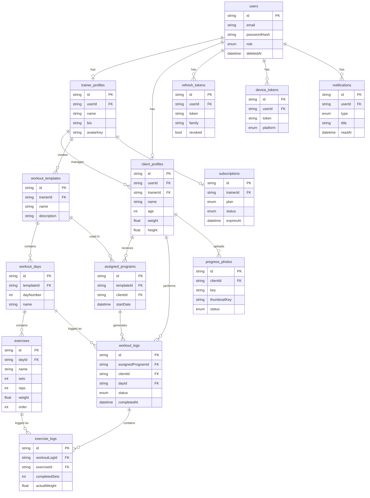

# Раздел 3 — Проектирование БД

## 3.1 schema.prisma

```prisma
generator client {
  provider = "prisma-client-js"
}

datasource db {
  provider = "postgresql"
  url      = env("DATABASE_URL")
}

// ─── Enums ────────────────────────────────────────────────────────────────────

enum Role {
  TRAINER
  CLIENT
}

enum SubscriptionPlan {
  FREE
  PRO
}

enum SubscriptionStatus {
  ACTIVE
  EXPIRED
  CANCELLED
}

enum WorkoutStatus {
  PENDING
  IN_PROGRESS
  COMPLETED
  SKIPPED
}

enum PhotoStatus {
  PENDING
  UPLOADED
  READY
  FAILED
}

enum NotificationType {
  WORKOUT_REMINDER
  WORKOUT_COMPLETED
  PHOTO_UPLOADED
  SUBSCRIPTION_EXPIRING
}

enum Platform {
  IOS
  ANDROID
}

// ─── Users & Profiles ────────────────────────────────────────────────────────

model User {
  id           String   @id @default(cuid())
  email        String   @unique
  passwordHash String
  role         Role
  createdAt    DateTime @default(now())
  updatedAt    DateTime @updatedAt
  deletedAt    DateTime?

  trainerProfile  TrainerProfile?
  clientProfile   ClientProfile?
  refreshTokens   RefreshToken[]
  deviceTokens    DeviceToken[]
  notifications   Notification[]
  sseEvents       SseEvent[]

  @@index([email])
  @@map("users")
}

model TrainerProfile {
  id             String   @id @default(cuid())
  userId         String   @unique
  user           User     @relation(fields: [userId], references: [id], onDelete: Cascade)
  name           String
  bio            String?
  avatarKey      String?
  specialization String?
  createdAt      DateTime @default(now())
  updatedAt      DateTime @updatedAt

  clients          ClientProfile[]
  workoutTemplates WorkoutTemplate[]
  subscription     Subscription?

  @@map("trainer_profiles")
}

model ClientProfile {
  id         String   @id @default(cuid())
  userId     String   @unique
  user       User     @relation(fields: [userId], references: [id], onDelete: Cascade)
  trainerId  String
  trainer    TrainerProfile @relation(fields: [trainerId], references: [id])
  name       String
  age        Int?
  goals      String?
  weight     Float?
  height     Float?
  avatarKey  String?
  createdAt  DateTime @default(now())
  updatedAt  DateTime @updatedAt

  assignedPrograms AssignedProgram[]
  workoutLogs      WorkoutLog[]
  progressPhotos   ProgressPhoto[]

  @@index([trainerId])
  @@map("client_profiles")
}

// ─── Workout Templates ───────────────────────────────────────────────────────

model WorkoutTemplate {
  id          String   @id @default(cuid())
  trainerId   String
  trainer     TrainerProfile @relation(fields: [trainerId], references: [id])
  name        String
  description String?
  createdAt   DateTime @default(now())
  updatedAt   DateTime @updatedAt

  days             WorkoutDay[]
  assignedPrograms AssignedProgram[]

  @@index([trainerId])
  @@map("workout_templates")
}

model WorkoutDay {
  id         String   @id @default(cuid())
  templateId String
  template   WorkoutTemplate @relation(fields: [templateId], references: [id], onDelete: Cascade)
  dayNumber  Int
  name       String
  createdAt  DateTime @default(now())

  exercises   Exercise[]
  workoutLogs WorkoutLog[]

  @@index([templateId])
  @@map("workout_days")
}

model Exercise {
  id          String  @id @default(cuid())
  dayId       String
  day         WorkoutDay @relation(fields: [dayId], references: [id], onDelete: Cascade)
  name        String
  sets        Int
  reps        Int?
  weight      Float?
  duration    Int?    // секунды (для кардио)
  notes       String?
  order       Int

  exerciseLogs ExerciseLog[]

  @@index([dayId])
  @@map("exercises")
}

// ─── Program Assignment & Execution ──────────────────────────────────────────

model AssignedProgram {
  id         String   @id @default(cuid())
  templateId String
  template   WorkoutTemplate @relation(fields: [templateId], references: [id])
  clientId   String
  client     ClientProfile   @relation(fields: [clientId], references: [id])
  startDate  DateTime
  createdAt  DateTime @default(now())

  workoutLogs WorkoutLog[]

  @@index([clientId])
  @@map("assigned_programs")
}

model WorkoutLog {
  id                String        @id @default(cuid())
  assignedProgramId String
  assignedProgram   AssignedProgram @relation(fields: [assignedProgramId], references: [id])
  clientId          String
  client            ClientProfile   @relation(fields: [clientId], references: [id])
  dayId             String
  day               WorkoutDay      @relation(fields: [dayId], references: [id])
  status            WorkoutStatus   @default(PENDING)
  startedAt         DateTime?
  completedAt       DateTime?
  createdAt         DateTime        @default(now())
  updatedAt         DateTime        @updatedAt

  exerciseLogs ExerciseLog[]

  @@index([clientId])
  @@index([assignedProgramId])
  @@map("workout_logs")
}

model ExerciseLog {
  id            String     @id @default(cuid())
  workoutLogId  String
  workoutLog    WorkoutLog @relation(fields: [workoutLogId], references: [id], onDelete: Cascade)
  exerciseId    String
  exercise      Exercise   @relation(fields: [exerciseId], references: [id])
  completedSets Int        @default(0)
  actualReps    Int?
  actualWeight  Float?
  notes         String?
  createdAt     DateTime   @default(now())
  updatedAt     DateTime   @updatedAt

  @@index([workoutLogId])
  @@map("exercise_logs")
}

// ─── Progress Photos ─────────────────────────────────────────────────────────

model ProgressPhoto {
  id           String      @id @default(cuid())
  clientId     String
  client       ClientProfile @relation(fields: [clientId], references: [id])
  key          String      @unique  // R2 object key
  thumbnailKey String?
  status       PhotoStatus @default(PENDING)
  takenAt      DateTime?
  uploadedAt   DateTime?
  createdAt    DateTime    @default(now())

  @@index([clientId])
  @@map("progress_photos")
}

// ─── Subscriptions ───────────────────────────────────────────────────────────

model Subscription {
  id               String             @id @default(cuid())
  trainerId        String             @unique
  trainer          TrainerProfile     @relation(fields: [trainerId], references: [id])
  plan             SubscriptionPlan   @default(FREE)
  status           SubscriptionStatus @default(ACTIVE)
  expiresAt        DateTime?
  revenuecatId     String?
  yoomoneyOrderId  String?
  createdAt        DateTime           @default(now())
  updatedAt        DateTime           @updatedAt

  @@map("subscriptions")
}

// ─── Auth & Sessions ─────────────────────────────────────────────────────────

model RefreshToken {
  id        String   @id @default(cuid())
  userId    String
  user      User     @relation(fields: [userId], references: [id], onDelete: Cascade)
  token     String   @unique
  family    String   // для детекции кражи
  revoked   Boolean  @default(false)
  expiresAt DateTime
  createdAt DateTime @default(now())

  @@index([userId])
  @@index([token])
  @@index([family])
  @@map("refresh_tokens")
}

// ─── Devices & Notifications ─────────────────────────────────────────────────

model DeviceToken {
  id        String   @id @default(cuid())
  userId    String
  user      User     @relation(fields: [userId], references: [id], onDelete: Cascade)
  token     String   @unique
  platform  Platform
  createdAt DateTime @default(now())
  updatedAt DateTime @updatedAt

  @@index([userId])
  @@map("device_tokens")
}

model Notification {
  id        String           @id @default(cuid())
  userId    String
  user      User             @relation(fields: [userId], references: [id], onDelete: Cascade)
  type      NotificationType
  title     String
  body      String
  data      Json?
  readAt    DateTime?
  createdAt DateTime         @default(now())

  @@index([userId])
  @@map("notifications")
}

model SseEvent {
  id        String   @id @default(cuid())
  userId    String
  user      User     @relation(fields: [userId], references: [id], onDelete: Cascade)
  eventType String
  payload   Json
  createdAt DateTime @default(now())

  @@index([userId, createdAt])
  @@map("sse_events")
}
```

---

## 3.2 ER-диаграмма



---

## 3.3 Обоснование ключевых решений

| Решение | Почему |
|---|---|
| `cuid()` вместо `uuid()` | Компактнее, URL-safe, монотонно возрастает — лучше для индексов |
| Soft-delete только на `users` | Каскадное удаление через `onDelete: Cascade` очищает связанные данные; сам пользователь остаётся для аудита |
| `token family` в `refresh_tokens` | Детекция кражи: при реюзе ревоцируем всю семью, а не один токен |
| `sse_events` в БД | Reconnect с `lastEventId` без Redis; TTL чистится pg-boss cron |
| `AssignedProgram` как отдельная сущность | Один шаблон можно назначить разным клиентам в разное время; история не ломается при изменении шаблона |
| `order` в `Exercise` | Явный порядок упражнений без сортировки по `createdAt` |
| `takenAt` в `ProgressPhoto` | Клиент может загрузить старое фото; дата съёмки отличается от даты загрузки |
